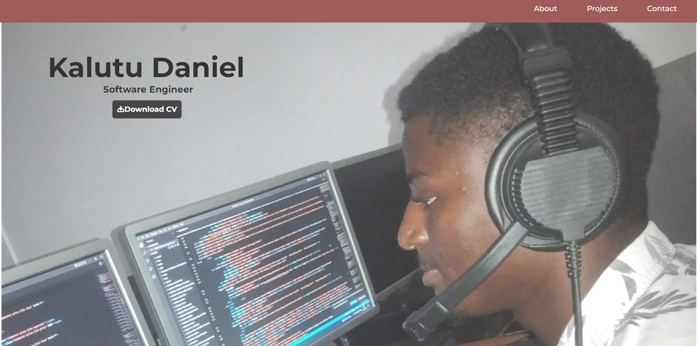

# Kalutu Daniel Portfolio
This is a personal portfolio website for Kalutu Daniel, a software engineer. The portfolio showcases Kalutu's skills, projects, and contact information.

## Preview 

## Table of Contents
- [About](#about)
- [Projects](#projects)
- [Contact](#contact)
- [Technologies Used](#technologies-used)
- [Usage](#usage)
- [Contributions](#contributions)
- [Credits](#credits)

## About
The "About" section provides an introduction to Kalutu Daniel. It highlights his educational background, experience, and expertise in software development. It also mentions his approach to collaboration and communication with clients.

## Projects
The "Projects" section displays a selection of Kalutu's projects. Each project is represented by an image, a title, and a link to the live version of the project. There is also a "See All" button that directs users to Kalutu's GitHub profile where they can explore more projects.

## Contact
The "Contact" section provides various ways to get in touch with Kalutu Daniel. It includes links to his LinkedIn profile, GitHub profile, email address, and phone number.

## Technologies Used
- HTML5
- CSS3

## Usage
To view the webpage, simply open the `index.html` file in a web browser. 
OR 
Visit https://kalutu-daniel.vercel.app/

## Contributions
Contributions to the project are welcome. Feel free to submit a pull request with any improvements or fixes.

## Credits
Readme created by Kalutu Daniel.

